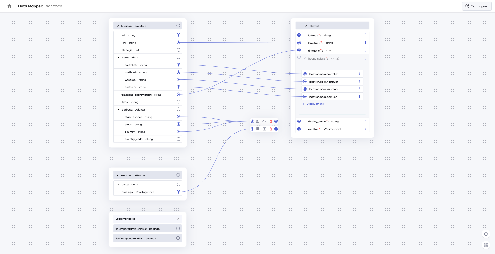

# [Ballerina] Data Mapper Sample

This contains a sample data mapping use case of transforming two JSON inputs into an output in different format.

- [Input 1](./tests/resources/location.json): A JSON object containing location information
- [Input 2](./tests/resources/weather.json): A JSON object containing weather information of the location of Input 1
- [Output](./tests/resources/output.json): A JSON object contains both location and weather information

## Data Mapper View

